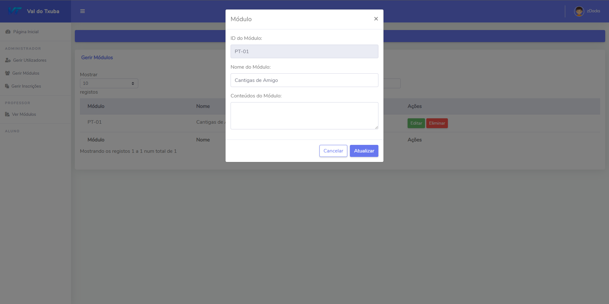

<h1 align="center">PT-WebSite</h3>
<br />
<div align="center">
  <a href="https://github.com/PMTSantos/pt-website/tree/main">
    
  </a>
  <h2 align="center">Val do Txuba</h2>
</div>

## INSTALAÇÃO DB

1.  Instalar [MYSQL](https://dev.mysql.com/downloads/installer/)<br><br>
2.  No Mysql Command Line Client digite os seguintes comandos <br><br>
    ```sh
    CREATE DATABASE vdt;
    ```
    ```sh
    SOURCE (DIRETORIO)\database.sql
    ```
    <br>


## INSTALAÇÃO SITE

1.  Instalar [NODE.JS](https://nodejs.dev/en/)

2.  No CMD executar o seguinte comando:<br>
      ```sh
      npm install body-parser ejs express express-session mysql2 path
      ``` 

3.  Abrir o diretorio do site no cmd e executar o seguinte comando <br>
       ```sh
       node index.js
       ```

## PROGRESSO

- [x] Login Funcional
- [ ] Dashboard Completa
- [ ] Conteudos Adicionados
- [ ] Testes Realizados
- [ ] Publicar Site

## PREVIEWS
<h2 align="center"> Administradores</h2>
<div align="center">
  <a href="https://github.com/PMTSantos/pt-website/tree/main">
    
    
    
    
    
    
    
    
    
  </a>
 </div>
 <br>
 <br>
 <h2 align="center"> Professores</h2>
<div align="center">
  <a href="https://github.com/PMTSantos/pt-website/tree/main">
    
    
    
    
    
  </a>
 </div>
  <br>
 <br>
 <h2 align="center"> Alunos</h2>
<div align="center">
  <a href="https://github.com/PMTSantos/pt-website/tree/main">
    
    
    
    
    
    
    
  </a>
 </div>

## FUNCIONALIDADES (Ainda serão adicionadas mais)
  - Admin:
    - Gerir Utilizadores
    - Gerir Módulos
    - Gerir Inscrições na Plataforma
  - Professor:
    - Gerir Conteudos dos Módulos designados
    - Criar Testes (Em fase de desenvolvimento)
  - Aluno:
    - Aceder aos conteudos dos módulos
    - Realizar Testes (Em fase de desenvolvimento)
 
## OBJETIVO

AINDA A PENSAR NUM TEXTO BONITO

# EQUIPA

TGEIO 20
